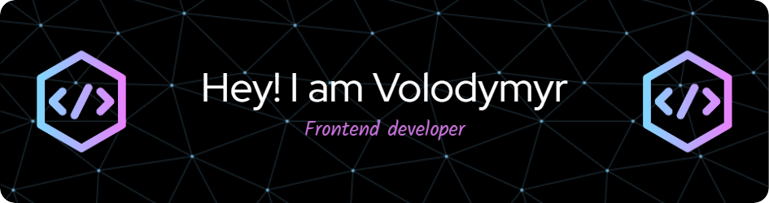

Coding isn’t just about lines of code for me. It’s about solving problems, creating experiences, and making things that matter. I’m the kind of person who sees coding as a tool to bring ideas to life, whether it’s optimizing a process or designing something that improves people’s day-to-day.

## 🧩 Tech Stack

### ⚛️ Frontend

### 🛠 Backend & State Management

### 🧰 Tools

### 🚀 Deployment & CI/CD

## 🌱 I’m currently learning

  
  

